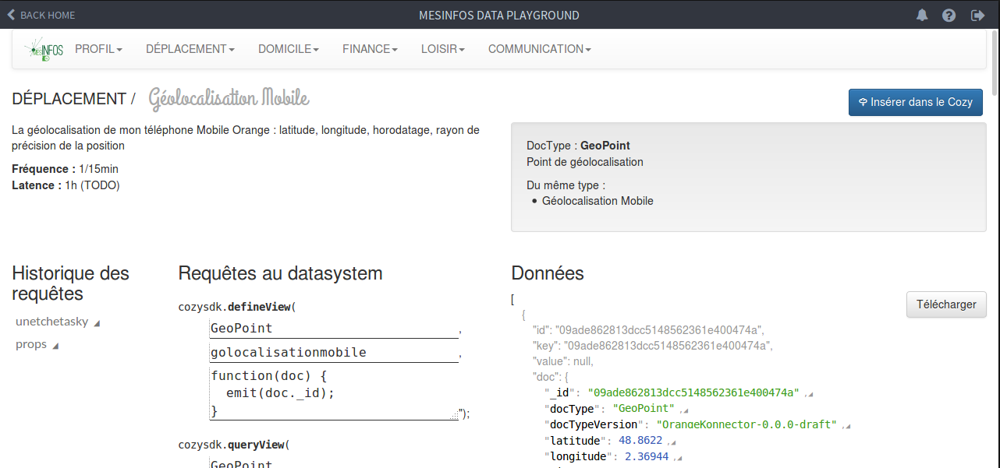

# MesInfos Dev : un outils pour les développeur MesInfos !




## Pré-requis

Si vous vous lancez dans le développement d'application MesInfos pour Cozy, suivez ce [tutoriel pas à pas](doc/hellomesinfos.md) pour bien commencer.

## Utiliser MesInfos-Dev

### Jeux de synthèse

Les jeux de données de synthèse sont des exemples des données MesInfos. Ce sont les données personnelles d'un personnage fictif (Germaine Dupond), qui permettront de visualiser les structures de données, et tester les applications pendant le développement.

Dans MesInfos-Dev, vous retrouverez dans la barre de menu, la liste des données, classées par typologies (comme sur la page _[Les données du pilote MesInfos](http://mesinfos.fing.org/cartographies/datapilote/)_). Vous pourrez alors,
* visualiser la documentation générale concernant ce type de données,
* insérer (ou supprimer) un jeu de donnée de synthèse du Cozy,
* visualiser les données brutes (json),
* visualiser la documentation propre à chaque champ,
* visualiser les requêtes à effectuer pour accèder à ces données,
* possibilité de télécharger les données.


### Faire des requêtes, accèder aux données dans le Cozy
L'interface _Requêtes au Datasystem_ imite l'interface du [cozy-client-js](https://github.com/cozy/cozy-client-js) :

1. créer les index
2. lancer les requêtes, avec les paramètres adéquats.

L'_Historique des requêtes_ permet de revoir et relancer les tentatives de requêtes précédentes.

### Insérer votre propre jeux de synthèse
La rubrique _Ajouter des données dans le Cozy_ vous permet de réaliser cela, à partir d'un fichier JSON que vous auriez construit. Il suffit de sélectionner un fichier via le bouton _parcourrir_ pour que le fichier soit analysé et les documents ajoutés au Cozy. Du fait du système de sécurité de Cozy, seul les doctypes déjà pris en charge par MesInfos-dev peuvent être insérés.

Ce fichier JSON doit avoir une structure bien précise : c'est une liste de documents (d'objets), et chaque document doit avoir un champ docType, renseigné avec le docType des documents à insérer. Exemple :

```
[
  {
    "docType": "fr.orange.geopoint",
    "timestamp": "2016-09-01T08:00:45.000Z",
    "latitude": 48.8661,
    "longitude": 2.37083
  },
  {
    "docType": "fr.orange.geopoint",
    "timestamp": "2016-09-01T08:00:30.000Z",
    "latitude": 48.8661,
    "longitude": 2.37083
  }
]
```

# Une question, contacter-nous

Pour obtenir de l'aide :
* [Faite-vous connaître](https://form.jotformeu.com/62294446261356) de l'équipe MesInfos (si vous ne l'avez déjà fait), et bénéficiez d'un accompagnement.
* Consultez et formulez vos questiosn sur le [forum Cozy](https://forum.cozy.io/)


# L'application

Open source, développée par la Fing, sous licence AGPL v3.

## Contribuer !
**Jeux de synthèse** : les jeux de synthèse proposés permettent d'initier le développement d'application, mais vous aurez probablement besoin d'en constituer d'autres, notamment pour traiter des cas extrèmes par rapport à l'usage que porposera votre application. Dans ce cas, il serait très généreux d'ouvrir ces données de synthèse à la communauté (via une Pull Request par exemple). Attention à bien anonymiser ces données !!

## TODO-list

### En cours
* traces d'usage

### Bug
* Afficher les messages, et les messages d'erreur à un lieu approprié.
* Améliorer affichage des valeurs de type Objet, ou Array.
* Temps de latence, peuvent rendre inutilisable.
* Pas de màj de la fonction de map ?

### Nouvelles fonctionnalités
* Bouton pour ajouter facilement un jeu de donnée custom
* Détecter les doctypes présents dans le Cozy
* Gérer de multiples jeux de synthèse par sous-type de données.

### Changelog

#### v4.0.0
* Nouvelles srouces et formats de méta-données
* Affichage hiérarchique de la documentation
* Affichage static du format de données.

#### v3.0.3
* Nouveaux jeux de synthèses
* Corrections de bugs mineurs.

#### v3.0.0
* Compatibilité Cozy V3

#### v1.0.2
* Màj des jeux de synthèse EDF.
* Fix : boutton envoyé inactif sur petits écrans.

#### v1.0.1
* Modification du nom pour mesinfos-dev
* Liens vers le tuto 'single page app'
* Modification des noms des méthodes de cozy-sdk (pour suivre la doc)


### Howto hack this app

You'll need a valid node.js/npm environment to develop the app. We use [Brunch](http://brunch.io/) as build tool. Before trying to develop the app, you need to load its dependencies:

```sh
npm i
```

#### Librairies

You should be aware of the app libraries in use:
* [Backbone](http://backbonejs.org/) is used for a quick and valid components architecture, like models
* [Marionette](http://marionettejs.com/) is the framework used upon Backbone to have a more clever and easier way to deal with views (like layouts, regions, and views switching)
* [BackboneProjections](https://github.com/andreypopp/backbone.projections) offers a lean way to keep context collections (like search filtering, etc) consistent over the whole app

#### Architecture

##### Files structure
TODO
##### App WorkFlow
TODO
